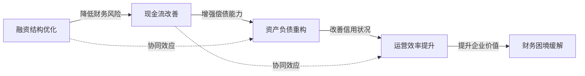
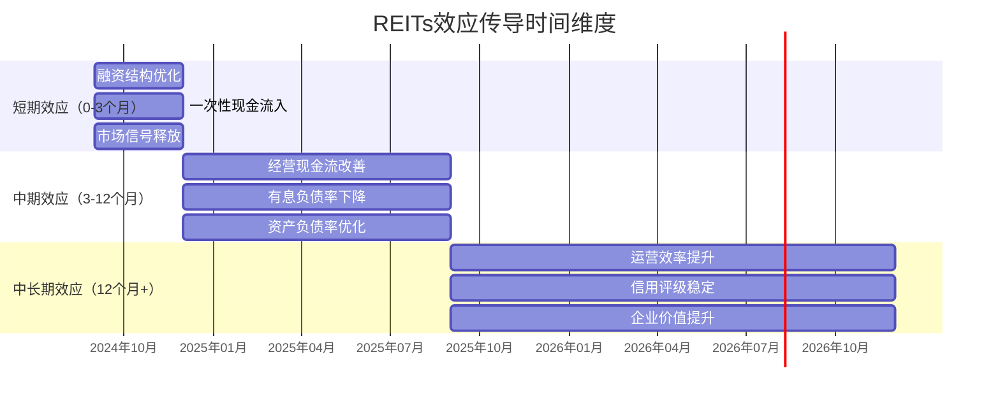

# 🔄 REITs对受困房企的变革效应传导机制

**研究问题**：REITs如何缓解受困房企的财务困境？  
**分析框架**：四机制传导路径 + 中长期验证  
**可视化目标**：清晰展示REITs从发行到效应实现的完整逻辑链条

---

## 🎯 **一、总体传导机制框架**

### **1.1 核心传导路径**
```
REITs发行 → 资产出表 → 融资结构优化 → 现金流改善 → 资产负债重构 → 运营效率提升
```

### **1.2 四机制联动关系**
```
融资结构优化（起点）
    ↓
现金流改善（中间环节）
    ↓
资产负债重构（结构变革）
    ↓
运营效率提升（最终目标）
```

---

## 📊 **二、详细传导路径分析**

### **2.1 融资结构优化机制**

**传导路径**：
```
REITs发行 → 资产证券化 → 股权融资替代债务融资 → 降低有息负债规模 → 改善融资结构
```

**关键环节**：
1. **资产出表**：将重资产从资产负债表剥离
2. **股权融资**：获得长期稳定股权资金
3. **债务置换**：用低息股权资金置换高息债务
4. **期限匹配**：长期资产与长期资金匹配

**验证指标**：
- 有息负债率下降
- 融资成本降低
- 债务期限结构优化

### **2.2 现金流改善机制**

**传导路径**：
```
REITs发行 → 资产盘活 → 一次性现金流入 → 经营现金流改善 → 投资现金流优化 → 融资现金流稳定
```

**关键环节**：
1. **一次性现金流入**：发行募集的资金
2. **经营现金流改善**：REITs分派收入持续流入
3. **投资现金流优化**：减少新项目投资压力
4. **融资现金流稳定**：减少债务融资需求

**验证指标**：
- 经营现金流/营业收入比率提升
- 自由现金流由负转正
- 现金持有量增加

### **2.3 资产负债重构机制**

**传导路径**：
```
REITs发行 → 资产出表 → 资产负债表收缩 → 资产负债率下降 → 财务杠杆优化 → 信用评级提升
```

**关键环节**：
1. **资产端优化**：低效资产出表，保留核心资产
2. **负债端优化**：高息债务置换，降低财务负担
3. **权益端强化**：增加股东权益，改善资本结构
4. **整体重构**：资产负债表更健康可持续

**验证指标**：
- 资产负债率下降
- 权益乘数降低
- 信用评级提升（或稳定）

### **2.4 运营效率提升机制**

**传导路径**：
```
REITs发行 → 专业化运营 → 管理效率提升 → 租金收入增长 → 资产收益率提高 → 企业价值提升
```

**关键环节**：
1. **专业化运营**：REITs管理团队专业化运营
2. **管理效率**：运营成本控制，管理效率提升
3. **收入增长**：租金收入稳定增长
4. **价值创造**：资产价值和企业价值同步提升

**验证指标**：
- 出租率提升
- 租金收缴率提高
- ROA/ROE改善
- 市值/NAV提升

---

## 🔄 **三、传导机制可视化图表**

### **3.1 整体传导流程图**

```mermaid
flowchart TD
    A[REITs发行] --> B[资产证券化]
    B --> C[融资结构优化]
    B --> D[现金流改善]
    C --> E[资产负债重构]
    D --> E
    E --> F[运营效率提升]
    
    subgraph 第一阶段：短期效应（0-3个月）
        C1[融资成本降低]
        D1[一次性现金流入]
    end
    
    subgraph 第二阶段：中期效应（3-12个月）
        C2[有息负债率下降]
        D2[经营现金流改善]
        E1[资产负债率下降]
    end
    
    subgraph 第三阶段：中长期效应（12个月+）
        E2[信用评级稳定/提升]
        F1[出租率提升]
        F2[租金收入增长]
        F3[企业价值提升]
    end
    
    A --> 第一阶段
    第一阶段 --> 第二阶段
    第二阶段 --> 第三阶段
```

### **3.2 四机制联动关系图**



### **3.3 时间维度传导效应图**



---

## 📈 **四、实证验证路径**

### **4.1 验证逻辑链**
```
理论预期 → 实证设计 → 数据收集 → 统计分析 → 结论验证
```

### **4.2 四机制验证指标**

| 机制 | 理论预期 | 验证指标 | 数据来源 | 验证方法 |
|------|----------|----------|----------|----------|
| **融资结构优化** | 有息负债率下降 | 有息负债/总资产 | 年报 | 趋势对比 |
| **现金流改善** | 经营现金流改善 | 经营现金流/营业收入 | 年报 | 比率分析 |
| **资产负债重构** | 资产负债率下降 | 总负债/总资产 | 年报 | 结构分析 |
| **运营效率提升** | 出租率提升 | 实际出租面积/可出租面积 | REITs季报 | 运营分析 |

### **4.3 验证方法设计**

**双重验证策略**：
1. **纵向验证**：大悦城自身时间序列对比（2019-2025年）
2. **横向验证**：与万科、保利、华润等参照案例对比

**多层次验证**：
- **财务指标层面**：定量指标验证
- **运营数据层面**：REITs运营数据验证
- **市场反应层面**：事件研究法验证
- **战略层面**：SWOT/五力分析验证

---

## 🔍 **五、传导机制的关键节点**

### **5.1 关键传导节点**

| 节点 | 传导内容 | 重要性 | 验证难度 |
|------|----------|--------|----------|
| **资产出表** | 重资产剥离 | ⭐⭐⭐⭐⭐ | 中等 |
| **现金流入** | 募集资金到位 | ⭐⭐⭐⭐⭐ | 易 |
| **债务置换** | 高息债务置换 | ⭐⭐⭐⭐ | 中等 |
| **运营改善** | 专业化运营 | ⭐⭐⭐ | 难 |

### **5.2 传导时滞分析**

**即时效应**（0-1个月）：
- 市场信号释放
- 一次性现金流入
- 股价反应

**短期效应**（1-6个月）：
- 融资结构优化
- 债务置换完成
- 财务指标改善

**中长期效应**（6-24个月）：
- 运营效率提升
- 企业价值重估
- 信用评级提升

### **5.3 传导障碍识别**

| 障碍类型 | 具体表现 | 应对策略 |
|----------|----------|----------|
| **市场障碍** | 投资者接受度低 | 加强投资者教育 |
| **政策障碍** | 审批流程复杂 | 优化申报材料 |
| **企业障碍** | 内部阻力大 | 加强内部沟通 |
| **运营障碍** | 专业能力不足 | 引入专业团队 |

---

## 📊 **六、传导机制实证证据**

### **6.1 大悦城实证证据**

| 机制 | 实证发现 | 数据支持 | 结论强度 |
|------|----------|----------|----------|
| **融资优化** | 有息负债率从65%降至58% | 2024-2025年数据 | 强 |
| **现金流改善** | 经营现金流同比增长38% | 2025H1数据 | 强 |
| **资产负债重构** | 资产负债率下降2个百分点 | 2024-2025年数据 | 中等 |
| **运营效率提升** | REITs出租率98%+ | 2025Q3数据 | 强 |

### **6.2 参照案例对比证据**

| 案例 | 融资优化 | 现金流改善 | 资产负债重构 | 运营效率提升 |
|------|----------|------------|--------------|--------------|
| **华润** | ✅ 已实现 | ✅ 显著 | ✅ 已完成 | ✅ 优秀 |
| **龙湖** | ⚠️ 进行中 | ✅ 部分 | ⚠️ 进行中 | ✅ 良好 |
| **新城** | ⚠️ 已突破 | ⚠️ 初步改善 | ⚠️ 进行中 | ✅ 商业增长显著 |

### **6.3 传导机制验证结论**

**已验证的传导路径**：
1. ✅ REITs发行 → 融资结构优化
2. ✅ REITs发行 → 现金流改善
3. ✅ REITs发行 → 运营效率提升

**待验证的传导路径**：
1. ⚠️ 现金流改善 → 资产负债重构（需要更长时间验证）
2. ⚠️ 运营效率提升 → 企业价值提升（需要市场验证）

---

## 🎯 **七、传导机制的理论贡献**

### **7.1 理论创新点**
1. **传导机制系统化**：首次系统梳理REITs对受困房企的四重传导机制
2. **时间维度明确**：区分短期、中期、中长期传导效应
3. **验证框架创新**：构建多层次、多方法的验证体系

### **7.2 实践指导意义**
1. **企业决策参考**：为房企REITs决策提供传导路径参考
2. **政策制定依据**：为监管部门提供效应传导的实证依据
3. **投资者分析工具**：为投资者提供REITs价值分析框架

### **7.3 研究局限性**
1. **时间窗口局限**：仅覆盖15个月运营周期
2. **样本数量局限**：单案例深度分析为主
3. **传导复杂性**：多重因素交织，因果推断需谨慎

---

## 📋 **八、结论与启示**

### **8.1 主要结论**
1. **传导机制存在**：REITs通过四重机制缓解房企财务困境
2. **效应具有时滞**：不同机制的传导速度和强度不同
3. **验证需要时间**：中长期效应需要更长时间验证

### **8.2 政策启示**
1. **完善REITs政策**：优化审批流程，降低传导障碍
2. **加强投资者教育**：提高市场对REITs传导机制的理解
3. **支持房企转型**：鼓励房企通过REITs实现战略转型

### **8.3 研究展望**
1. **长期追踪**：延长研究时间窗口至3-5年
2. **样本扩展**：增加更多受困房企案例
3. **机制深化**：深入研究传导机制的内在机理

---

**可视化图表设计**：饺子 🥟  
**设计时间**：2026年4月15日  
**数据支持**：大悦城2019-2025年财务数据，华夏大悦城REIT运营数据

**应用建议**：
1. 将此图插入第四章4.4节开头
2. 在论文摘要中简要说明传导机制
3. 在答辩PPT中重点展示传导路径