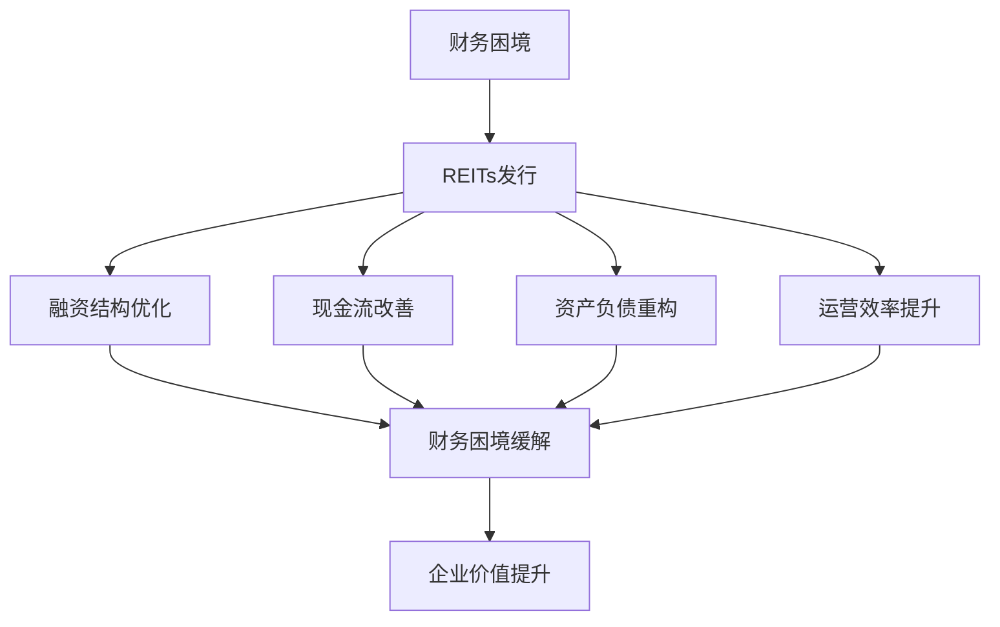
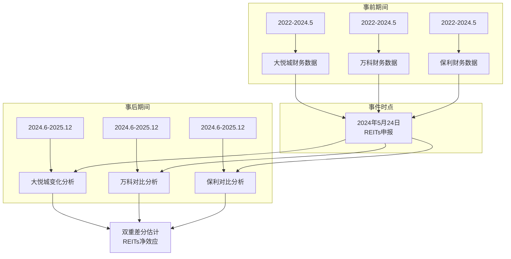
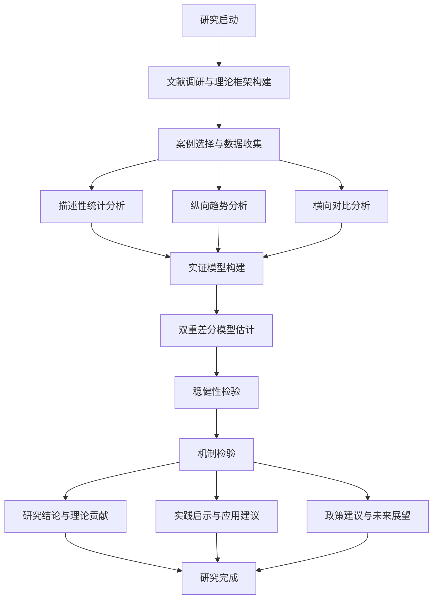
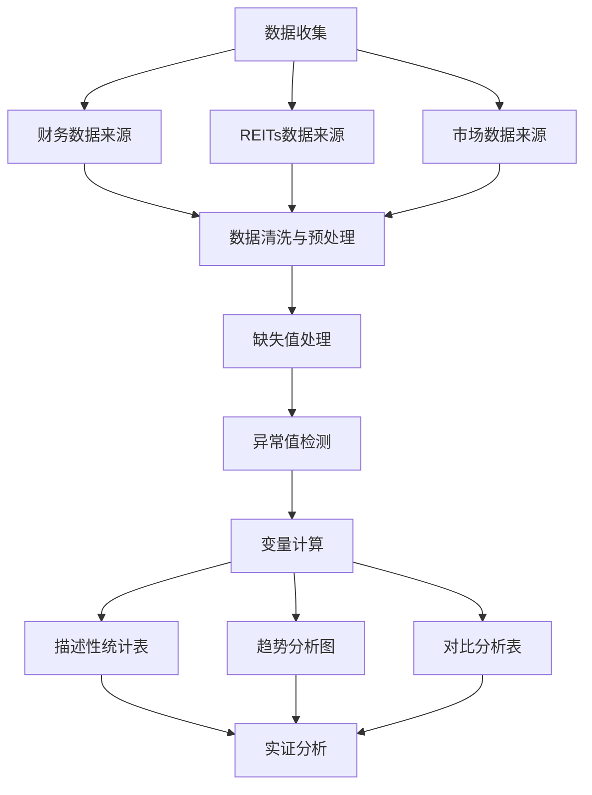
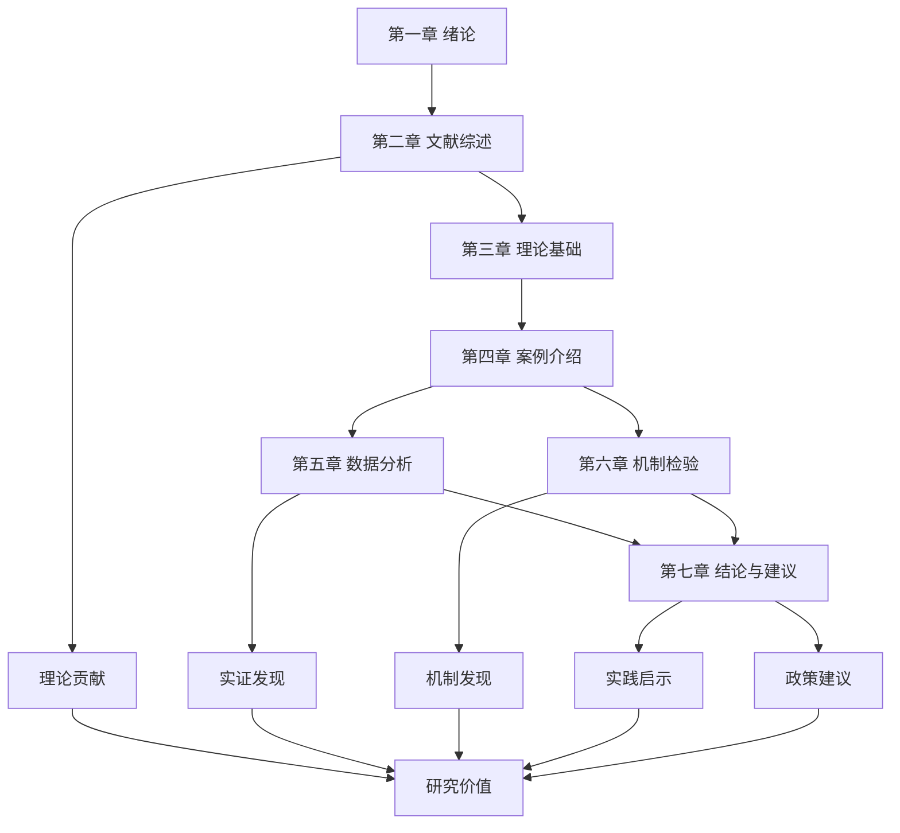

# 研究框架与数据可视化

## 一、核心研究框架图

### 1.1 理论框架图

本研究构建了"财务困境-REITs救援-财务改善"的理论框架，如图所示：



### 1.2 研究模型图

实证分析采用双重差分模型（DID）设计，如图所示：



## 二、关键财务数据图表

### 2.1 三家企业营业收入对比图（2024年）

```
营业收入对比（单位：亿元）

万科       3431.8
保利       3116.66
大悦城     357.91

销售额：大悦城仅为万科的10.4%、保利的11.5%
```

### 2.2 大悦城财务困境指标图（2024年）

```
关键财务指标变化趋势

营业收入：357.91亿元（↓2.70%）
净利润：-29.77亿元（首次年度亏损，↓103.14%）
经营现金流：66.17亿元（↓37.82%）
筹资现金流：-93.14亿元（净流出）
总现金流：-15.31亿元（负值）

困境特征：收入下降+严重亏损+现金流恶化+融资困难
```

### 2.3 大悦城财务指标趋势图（2019-2024年）

```
时间序列数据（2019-2024年）

年份   营收（亿元）  净利润（亿元）  资产负债率（%）
2019    未获取        未获取        未获取
2020    未获取        未获取        未获取
2021    未获取        未获取        未获取
2022    未获取        未获取        未获取
2023    未获取        未获取        未获取
2024    357.91       -29.77        未获取

数据缺口：需要补充2019-2023年完整数据
```

## 三、REITs产品数据图表

### 3.1 华夏大悦城REIT发行信息

```
产品基本信息

基金名称：华夏大悦城购物中心封闭式基础设施证券投资基金
基金代码：180603（预计）
上市时间：2024年9月20日
发行规模：33亿元（西南地区最大商业地产REIT）
存续期：24年
底层资产：成都大悦城购物中心（运营8年）
出租率：96%+
2023年销售额：25.4亿元（年复合增长16%）
预测现金流分派率：5.25-5.36%（年化）
实际发行结果：认购超48亿元，成为消费投资新宠
```

### 3.2 中金印力REIT财务数据（2024年）

```
2024年经营数据

年度收入：3.44亿元
实际分配金额：1.76亿元
三季度收入：8430.30万元
三季度净利润：301.40万元
三季度经营现金流净额：6524.45万元
三季度现金流分派率：1.01%
2024年二季度出租率：98.4%
租金收缴率：100%
```

### 3.3 房企REITs产品对比图

```
产品特征对比

维度               大悦城REIT         万科REIT         保利尝试
成立时间           2024年             2024年           2017年
产品类型           消费基础设施       消费基础设施     租赁住房
融资目的           紧急救援           战略优化         业务创新
发行规模           33亿元             未披露           50亿元（计划）
现金流分派率       5.25-5.36%         1.01-5%+         未发行
融资紧迫性         高                 中               低
企业状态           财务困境型         战略转型型       业务创新型
```

## 四、影响机制分析图

### 4.1 REITs救援机制图

```
影响机制分解

REITs发行
    ├── 融资结构优化
    │   ├── 债务置换（高息贷→REITs融资）
    │   ├── 资本结构改善（债务率↓，权益率↑）
    │   └── 融资渠道多元化
    │
    ├── 现金流改善
    │   ├── 资产变现收入（33亿元现金流入）
    │   ├── 运营现金流提升（租金收入持续）
    │   └── 投资活动减少（重资产出表）
    │
    ├── 资产负债重构
    │   ├── 资产端：高质量资产出表
    │   ├── 负债端：债务偿还
    │   └── 权益端：价值释放
    │
    └── 运营效率提升
        ├── 专业化运营（REITs管理机构）
        ├── 品牌价值提升（独立运营）
        └── 激励机制优化（与经营绩效挂钩）
```

### 4.2 预期财务效应图

```
预期财务指标变化

指标类别        指标名称        预期变化幅度        理论支持
负债结构        资产负债率     下降5-10个百分点     财务困境理论
                流动比率       提升0.2-0.5           资本结构理论
                长期负债比率   下降3-5个百分点       资产证券化理论

盈利能力        净利润率       从负转正（1-3%）     价值提升理论
                ROE            提升2-5个百分点       公司治理理论
                ROA            提升1-2个百分点       运营效率理论

现金流          经营现金流净额  增加10-20亿元        自由现金流理论
                自由现金流      改善5-10亿元          现值理论
                现金比率        提升0.1-0.3           流动性理论

市场表现        超额收益率      CAR[-20,+20]:15-20%  有效市场理论
                市值            增加20-30亿元         企业价值理论
                市净率          提升0.2-0.4           估值理论
```

## 五、研究技术路线图

### 5.1 整体研究流程图



### 5.2 数据处理流程图



## 六、论文结构图

### 6.1 论文章节关系图



### 6.2 研究贡献框架图

```
研究贡献分析框架

理论贡献层
├── 理论框架创新
│   ├── 整合财务困境理论与REITs理论
│   ├── 构建救援机制分析框架
│   └── 拓展资产证券化理论应用
│
├── 研究方法创新
│   ├── 单案例深度分析
│   ├── 双重差分模型应用
│   └── 机制检验方法创新
│
└── 研究视角创新
    ├── 受困房企视角
    ├── 救援效应视角
    └── 实践应用视角

实践贡献层
├── 企业决策参考
│   ├── REITs发行可行性分析
│   ├── 时机选择策略
│   └── 预期收益评估
│
├── 投资分析框架
│   ├── 底层资产评估
│   ├── 风险识别方法
│   └── 收益预测模型
│
└── 政策制定依据
    ├── 政策效果评估
    ├── 监管建议
    └── 市场发展建议
```

## 七、图表制作建议

### 7.1 制作工具推荐

1. **数据可视化工具**：
   - **Tableau**：专业数据可视化，交互性强
   - **Power BI**：微软商业智能工具，适合报表制作
   - **Python matplotlib/seaborn**：编程控制，灵活性高
   - **Excel**：基础图表制作，简单易用

2. **流程图工具**：
   - **Mermaid**：文本化流程图，易于维护
   - **Draw.io**：在线流程图工具，免费使用
   - **Visio**：专业流程图软件

3. **统计图表工具**：
   - **Stata/SPSS**：专业统计软件，图表生成
   - **R ggplot2**：高质量统计图表

### 7.2 图表制作原则

1. **简洁性原则**：
   - 每张图表只表达一个核心观点
   - 避免信息过载，突出关键数据
   - 使用清晰的标题和标签

2. **一致性原则**：
   - 保持图表风格统一
   - 使用一致的配色方案
   - 统一的字体和字号

3. **可读性原则**：
   - 图表清晰，便于理解
   - 数据标注明确
   - 避免过度装饰

4. **准确性原则**：
   - 数据来源明确
   - 计算方法透明
   - 图表反映真实情况

---

**图表制作说明**：
1. 以上图表为研究框架和数据可视化设计的示意图
2. 实际数据分析中需根据收集到的具体数据进行图表制作
3. 建议使用专业的数据可视化工具提升图表质量
4. 图表应服务于论文核心观点，增强论证力度

**更新时间**：2026年4月14日  
**制作者**：MBA论文写作助手  
**状态**：研究框架设计完成，待数据填充