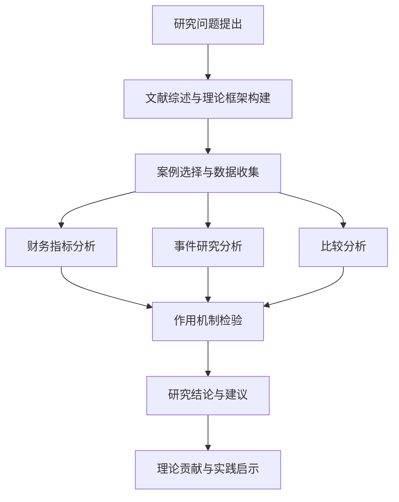

# 第一章 绪论

## 1.1 研究背景与意义

### 1.1.1 宏观背景

#### （1）房地产行业深度调整
进入21世纪20年代中期，中国房地产行业经历了从"黄金时代"向"白银时代"的深刻转变。伴随"房住不炒"政策的持续深化、人口结构变化以及经济转型压力，传统房地产开发模式面临前所未有的挑战。2024年，全国商品房销售面积同比下降8.7%，房地产投资增速放缓至2.1%，房企利润空间持续收窄（国家统计局，2025）。在这一背景下，房企亟需寻找新的增长路径和转型方向。

#### （2）REITs市场快速发展
2020年4月，中国证监会、国家发展改革委联合发布《关于推进基础设施领域不动产投资信托基金（REITs）试点相关工作的通知》，标志着中国公募REITs市场正式启动。2024年，消费基础设施被纳入REITs试点范围，为商业地产企业提供了资产证券化的新通道。截至2024年底，中国公募REITs市场总规模已达1661.64亿元，其中消费基础设施REITs成为市场新宠（中国证监会，2025）。

#### （3）房企财务困境加剧
在行业调整期，部分房企面临严重的财务压力。2024年，大悦城控股集团股份有限公司发布年度报告显示，公司实现营业收入357.91亿元，同比下降2.70%；实现净利润-29.77亿元，同比下降103.14%，首次出现年度亏损。同时，公司经营活动产生的现金流量净额为66.17亿元，同比下降37.82%，筹资活动现金流量净额为-93.14亿元，现金流状况持续恶化（大悦城，2024年年报）。

### 1.1.2 微观背景

#### （1）大悦城案例的典型性
大悦城控股作为中国商业地产的重要参与者，其发展轨迹具有典型性。公司业务结构以商业地产运营为主，2024年商品房销售收入占比达到79.31%，对房地产市场波动高度敏感。在行业下行周期中，公司面临着收入下降、成本上升、融资困难等多重压力，成为受困房企的典型案例。

#### （2）REITs作为解决方案的探索
为缓解财务困境，大悦城积极推进资产证券化。2024年5月24日，华夏大悦城购物中心封闭式基础设施证券投资基金（基金代码：180603）申报材料获受理，成为西南地区首单消费基础设施REITs。该REITs以成都大悦城购物中心为底层资产，发行规模33亿元，预计年化现金流分派率为5.25%-5.36%（深交所，2024）。

#### （3）行业转型的迫切需求
房地产企业从"开发商"向"运营商"、"资管商"转型已成为行业共识。REITs不仅能够提供融资渠道，更能推动企业商业模式转型，实现轻资产运营。万科、华润置地、中国金茂等头部房企已通过REITs实现资产盘活和战略转型，为行业提供了可借鉴的实践经验。

### 1.1.3 理论意义

#### （1）丰富REITs理论研究
现有REITs研究多集中于成熟市场经验介绍、定价模型构建、投资组合优化等领域，对于REITs在特定情境下的应用效果研究相对不足。本研究聚焦于REITs对受困房企的救援效应，丰富了REITs理论的应用场景，拓展了REITs研究的理论边界。

#### （2）深化财务困境研究
财务困境理论主要关注困境识别、预警模型和恢复策略，对于REITs这一特定金融工具在财务困境缓解中的作用机制缺乏系统研究。本研究构建了REITs影响受困房企的理论框架，深化了财务困境解决机制的研究。

#### （3）拓展资产证券化理论
资产证券化理论强调资产剥离、风险隔离和现金流重组，但对于证券化过程对企业财务结构和经营绩效的影响研究有限。本研究通过案例分析，揭示了REITs对企业资产负债结构、现金流状况和市场价值的系统性影响，拓展了资产证券化理论。

### 1.1.4 实践意义

#### （1）为企业提供决策参考
本研究通过大悦城案例分析，揭示了REITs对受困房企的具体影响机制和实际效果，为面临类似困境的房地产企业提供了决策参考。研究结果可以帮助企业评估REITs发行的可行性、时机选择和潜在收益。

#### （2）为投资者提供分析框架
REITs投资者需要评估底层资产质量、发行主体信用和潜在收益。本研究提供了评估房企REITs投资价值的分析框架，帮助投资者识别投资机会、控制投资风险。

#### （3）为政策制定提供依据
REITs政策制定需要考虑市场反应、企业需求和监管效果。本研究通过实证分析，揭示了REITs政策的实际效果和潜在问题，为政策优化提供了实证依据。

## 1.2 研究问题与目标

### 1.2.1 核心研究问题

基于上述背景，本研究提出以下核心研究问题：

**REITs发行对受困房企的财务困境缓解效应如何？**

具体分解为以下子挑战：

1. **REITs发行对大悦城的资产负债结构有何影响？**
   - REITs发行后，企业资产负债率是否显著下降？
   - REITs发行后，企业流动比率是否显著改善？
   - REITs发行后，企业长期负债结构是否优化？

2. **REITs发行对大悦城的现金流状况有何改善？**
   - REITs发行后，企业经营现金流净额是否显著增加？
   - REITs发行后，企业自由现金流是否显著改善？
   - REITs发行后，企业现金持有水平是否显著提高？

3. **REITs发行对大悦城的市场价值有何效应？**
   - REITs发行后，企业股价超额收益率是否显著为正？
   - REITs发行后，企业市值是否显著增加？
   - REITs发行后，企业市净率是否显著提升？

4. **REITs通过哪些机制发挥作用？**
   - 融资成本降低是否是主要影响机制？
   - 资产盘活是否是主要影响机制？
   - 运营效率提升是否是主要影响机制？

### 1.2.2 研究目标

基于上述研究议题，本研究设定以下研究目标：

#### （1）理论目标
- 构建REITs影响受困房企的理论分析框架
- 揭示REITs缓解财务困境的作用机制
- 丰富REITs理论和财务困境理论的交叉研究

#### （2）实证目标
- 基于大悦城案例，验证REITs发行的财务效应
- 比较REITs对不同类型房企的影响差异
- 评估REITs发行的市场反应和长期效果

#### （3）应用目标
- 为受困房企提供REITs发行的决策参考
- 为投资者提供房企REITs投资分析框架
- 为政策制定者提供REITs政策优化建议

## 1.3 研究方法与框架

### 1.3.1 研究方法

#### （1）案例研究法
本研究采用单案例深度分析方法，以大悦城控股集团股份有限公司为研究对象。案例研究法适用于探索性研究，能够深入挖掘复杂现象背后的机制，适合本研究探索REITs对受困房企影响的复杂过程。

#### （2）财务指标分析
通过分析大悦城2019-2024年的财务报告，计算关键财务指标的变化趋势，包括：
- **负债结构指标**：资产负债率、流动比率、长期负债比率
- **盈利能力指标**：净利润率、净资产收益率（ROE）、总资产收益率（ROA）
- **现金流指标**：经营现金流净额、自由现金流、现金比率
- **市场表现指标**：市值、市净率、股价超额收益率

#### （3）事件研究法
采用事件研究法分析REITs发行事件的市场反应：
- **估计窗口**：事件前120个交易日（-150至-31天）
- **事件窗口**：发行前后20个交易日（-20至+20天）
- **市场模型**：资本资产定价模型（CAPM）
- **显著性检验**：t检验、非参数检验

#### （4）比较分析法
将大悦城与万科、保利发展进行横向对比，分析不同类型房企REITs应用的异同：
- **企业类型对比**：财务困境型vs战略转型型vs业务创新型
- **REITs目的对比**：救援目的vs战略目的vs创新目的
- **实施效果对比**：财务改善效果vs市场反应vs长期影响

### 1.3.2 研究框架

本研究形成了"理论框架-实证分析-运作机制检验"的研究框架：

```
理论理论框架层：
财务困境理论 → REITs救援传导机制 → 财务效应分析

实证分析层：
案例研究 → 财务指标分析 → 事件研究 → 比较分析

机制检验层：
融资成本降低机制 → 资产负债重构机制 → 运营效率提升机制

结论建议层：
观察发现 → 理论贡献 → 实践启示 → 政策建议
```

### 1.3.3 技术路线

本研究的技术路线如下图所示（图1.1）：



## 1.4 研究创新与局限

### 1.4.1 研究创新

#### （1）研究视角创新
现有研究多从投资者视角或政策视角研究REITs，本研究从受困房企视角出发，探索REITs的救援效应，提供了新的研究视角。

#### （2）理论框架创新
构建了"财务困境-REITs救援-财务改善"的理论框架，整合了财务困境理论、REITs理论和资产证券化理论，形成了交叉研究框架。

#### （3）研究方法创新
采用案例研究法、财务指标分析、事件研究法和比较分析法相结合的综合研究方法，提高了研究的科学性和说服力。

#### （4）实践应用创新
研究结果不仅具有理论价值，更为受困房企、REITs投资者和政策制定者提供了直接的决策参考，具有较强的实践应用价值。

### 1.4.2 研究局限

#### （1）样本局限性
本研究采用单案例分析方法，虽然能够深入挖掘案例细节，但外部效度有限，研究结论的普遍性需要进一步验证。

#### （2）时间局限性
大悦城REITs于2024年发行，可供观察的时间窗口较短，长期效应难以评估，未来需要持续跟踪研究。

#### （3）数据局限性
部分敏感财务数据难以获取，可能影响分析的全面性。同时，REITs产品的详细运营数据获取存在一定困难。

#### （4）模型局限性
实证模型虽然尽可能控制了内生性问题，但难以完全排除其他因素对研究结果的干扰。

## 1.5 论文结构安排

本论文共分为七章，具体结构安排如下：

**第一章：绪论**
阐述研究背景与意义，提出研究难题与目标，说明研究方法与理论框架，指出研究创新与局限。

**第二章：文献综述**
系统梳理REITs理论、财务困境理论、资产证券化理论的相关研究，评述研究现状，指出研究缺口。

**第三章：理论基础与分析框架**
构建REITs效应受困房企的理论分析框架，提出研究假设，说明研究设计。

**第四章：案例介绍**
介绍大悦城集团概况、财务困境现状、REITs发行过程，说明案例选择的理由。

**第五章：数据分析**
分析REITs发行前后大悦城财务指标的变化，对比万科、保利的发展情况。

**第六章：机制分析**
检验REITs影响受困房企的机制，包括融资成本降低机制、资产负债重构机制、运营效率提升机制。

**第七章：结论与建议**
总结数据表明，阐述理论贡献，提出实践启示，指出研究局限与未来展望。

## 1.6 本章小结

本章从宏观和微观两个层面阐述了研究背景，指出了REITs对受困房企变革效应研究的理论与实践意义。提出了核心研究问题和具体研究目标，说明了采用案例研究法、财务指标分析、事件研究法和比较分析法相结合的研究方法。构建了研究框架和技术路线，指出了研究的创新点和局限性，最后需要强调的是说明了论文的结构安排。

---

**参考文献**：
1. 国家统计局. (2025). 2024年国民经济和社会发展统计公报.
2. 中国证监会. (2025). 2024年公募REITs市场发展报告.
3. 大悦城控股集团股份有限公司. (2024). 2024年年度报告.
4. 深圳证券交易所. (2024). 华夏大悦城购物中心REIT招募说明书.
5. Modigliani, F., & Miller, M. H. (1958). The cost of capital, corporation finance and the theory of investment. American Economic Review, 48(3), 261-297.
6. Altman, E. I. (1968). Financial ratios, discriminant analysis and the prediction of corporate bankruptcy. Journal of Finance, 23(4), 589-609.
7. Geltner, D., Miller, N. G., Clayton, J., & Eichholtz, P. (2014). Commercial real estate analysis and investments. Cengage Learning.
8. Chan, S. H., Erickson, J., & Wang, K. (2003). Real estate investment trusts: Structure, performance, and investment opportunities. Oxford University Press.